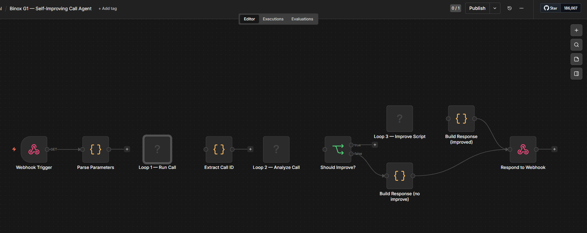

# Binox G1 — Self-Improving Call Center Agent

A fully functional AI agent that simulates cold sales calls, analyzes outcomes with Claude, and iteratively rewrites its own script. Built for the Binox 2026 Graduate Take-Home Assessment.

---

## Architecture

```
n8n Orchestrator (webhook trigger)
        │
        ├── Loop 1: Call Simulation (run_call.py)
        │     ├─ Loads script.json (current script version)
        │     ├─ Selects a prospect persona from personas.json
        │     ├─ Runs agent ↔ prospect dialogue via Claude API (mock TTS/STT)
        │     └─ Saves transcript → transcripts/<call_id>.json
        │
        ├── Loop 2: Outcome Analysis (analyze_call.py)
        │     ├─ Reads transcript
        │     ├─ Claude produces structured JSON: score, objections, stage ratings, insights
        │     └─ Appends result → data/outcomes.json
        │
        └── Loop 3: Script Improvement (improve_script.py)
              ├─ Aggregates all outcomes in outcomes.json
              ├─ Claude rewrites script.json (increments version, adds objection handlers)
              ├─ Logs before/after diff → data/changes.json
              └─ Clears outcomes.json for next cycle
```

See `architecture_diagram.svg` (or the diagram in the README preview) for the visual flow.


---

## Quick Start

### 1. Clone and install

```bash
git clone <your-repo-url>
cd binox-g1
pip install -r requirements.txt
```

### 2. Set your API key

```bash
export ANTHROPIC_API_KEY=sk-ant-...
```

### 3. Run a single full cycle (call → analyze → improve)

```bash
python run_cycle.py
```

### 4. Run 2 full iteration cycles back to back (as required by the demo)

```bash
python run_cycle.py --cycles 2
```

### 5. Run with a specific prospect persona

```bash
# Available: persona_budget | persona_busy | persona_interested | persona_skeptic
python run_cycle.py --persona persona_budget
```

### 6. Run individual loops manually

```bash
# Loop 1 only
python run_call.py persona_skeptic

# Loop 2 only (replace with your call_id)
python analyze_call.py call_20260428T120000_persona_skeptic

# Loop 3 only
python improve_script.py
```

---

## n8n Integration

1. Install n8n: `npx n8n` or via Docker (`docker run -it --rm -p 5678:5678 n8nio/n8n`)
2. Open `http://localhost:5678` → Settings → Import Workflow → select `n8n/workflow.json`
3. In each "Execute Command" node, update the path to your `binox-g1` directory
4. Set `ANTHROPIC_API_KEY` in n8n's environment (Settings → Environment Variables)
5. Activate the workflow
6. Trigger a cycle via:

```bash
curl -X POST http://localhost:5678/webhook/run-cycle \
  -H "Content-Type: application/json" \
  -d '{"persona_id": "persona_budget", "improve": true}'
```

---

## Data Files

| File | Purpose |
|---|---|
| `data/script.json` | Current versioned sales script — the "brain" of the agent |
| `data/outcomes.json` | Accumulated per-call analysis results (cleared after each improvement) |
| `data/changes.json` | Full history of script improvements (before/after diffs) |
| `data/personas.json` | Prospect personas used for simulation |
| `transcripts/` | Raw call transcripts (JSON), one per call |

---

## How the Improvement Logic Works

After each call, Claude analyzes:
- **Objections raised** and whether they were handled
- **Stage performance** (greeting / discovery / pitch / close)
- **Sentiment arc** (how the prospect's mood changed)
- **Suggested changes**: specific line rewrites and new objection handlers

When Loop 3 runs, it aggregates all outcomes and passes them to Claude with the prompt: *"Here is what went wrong across N calls. Rewrite the script to address these patterns."*

Claude then:
1. Rewrites weak `agent_line` entries with stronger alternatives
2. Adds `objection_handlers` (key = paraphrased objection, value = response strategy)
3. Increments `version` and documents changes in `improvement_notes`

**Example improvement** (from v1 → v2):
- Discovery stage: added open question about team size after observing that budget objections arose early when the agent jumped to pitching too fast
- Close stage: added handler for "send me an email instead" → redirect to scheduling a 5-minute screen share

---

## Self-Assessment

### What works well

**Separation of concerns** — each loop is a standalone Python script with no shared state beyond JSON files. This makes each step independently testable and easy to debug.

**Structured analysis output** — by prompting Claude to return a fixed JSON schema in the analysis step, aggregation in the improvement step is deterministic. No parsing ambiguity.

**Persona variety** — four distinct prospect archetypes (budget-conscious, time-poor, genuinely interested, data-driven skeptic) give the improvement loop meaningful signal across different failure modes.

**Versioned memory** — `changes.json` stores full before/after diffs, making the improvement history auditable and reproducible.

### Trade-offs made

**Mock TTS/STT** — text simulation instead of real voice (ElevenLabs + Whisper). This was the right call for a take-home: it eliminates latency, cost, and reliability variables so the feedback loop itself can be demoed deterministically. In production, the `mock_tts()` and `mock_stt()` functions are the only two places that need replacing.

**Flat JSON memory over a vector store** — for 10-20 calls this is simpler and more transparent than embeddings. At scale (100+ calls), a vector store for semantic objection clustering would be more appropriate.

**Single LLM for all three roles** — the agent, the prospect, and the analyst all use Claude. In production you'd want the analyst to be a separate, possibly fine-tuned model to avoid the analysis being influenced by the same biases that drove the call.

**One improvement cycle per call** — the current design runs Loop 3 after every call. A more realistic production setup would batch 5-10 calls before improving, to avoid over-fitting to a single interaction.

### If I had more time

- Add a scoring dashboard (web UI showing score trends across versions)
- Implement multi-turn objection clustering using embeddings to group semantically similar objections
- Add A/B testing: run the same persona against v(n) and v(n+1) scripts to measure actual improvement
- Integrate ElevenLabs TTS for real audio output (the mock functions are already the abstraction boundary)

---

## Business Impact Reasoning

**Client value**: A self-improving script reduces the time sales managers spend manually reviewing calls and updating playbooks. Each improvement cycle replaces what would typically be a weekly coaching session.

**Cost model**: At ~$0.003/1k tokens (Claude Sonnet), a full cycle (call + analysis + improvement) costs roughly $0.05-0.10. At 100 cycles, the total cost is under $10 — far less than a single hour of sales coaching time.

**Adoption path**: This prototype maps directly to a real call center deployment: replace mock TTS/STT with a VoIP integration, swap the persona simulator for real prospect phone numbers, and point n8n at a production server.

---

## Project Structure

```
binox-g1/
├── run_call.py          # Loop 1: call simulation
├── analyze_call.py      # Loop 2: outcome analysis
├── improve_script.py    # Loop 3: script improvement
├── run_cycle.py         # Demo runner (all 3 loops)
├── requirements.txt
├── README.md
├── data/
│   ├── script.json      # Current script (versioned)
│   ├── outcomes.json    # Per-call results
│   ├── changes.json     # Improvement history
│   └── personas.json    # Prospect archetypes
├── transcripts/         # Raw call logs
│   └── call_<id>.json
└── n8n/
    └── workflow.json    # Importable n8n workflow
```
